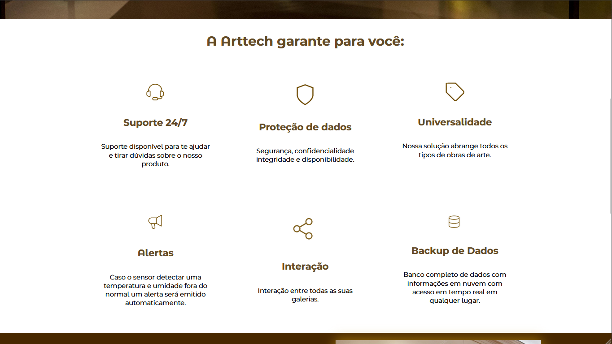
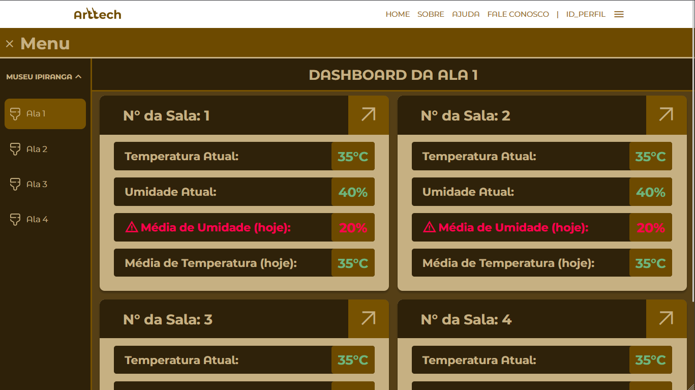
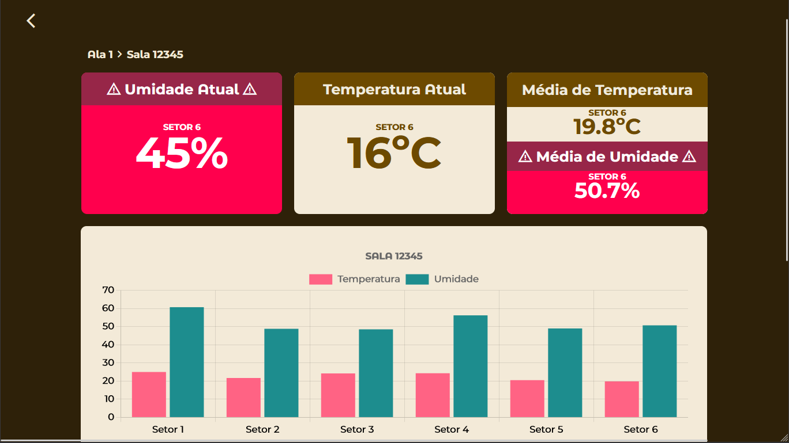

# Arttech
 Este é um projeto que tem como objetivo monitorar a temperatura e umidade em ambientes de exposição e armazenamento de obras de arte, visando preservar a integridade e qualidade das mesmas. O projeto faz parte da disciplina de Pesquisa e Inovação da SPTech.

## Como funciona
O projeto depende da instalação de sensores que captam os níveis de temperatura e umidade, e alertas desenhados às necessidades da preservação das obras de arte. 
O cliente consegue monitorar os níveis de temperatura e umidade remotamente através de uma aplicação web. Com a ajuda desse monitoramento, nossos parceiros conseguem tomar ações adequadas e embasadas em relação à preservação de seu acervo.

Ao contratar nosso serviço, o cliente tem acesso a uma tela de monitoramento com os dados coletados pelos nossos sensores e representações gráficas deles:

## Ferramentas utilizadas
 
          
          
